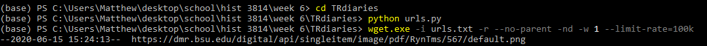
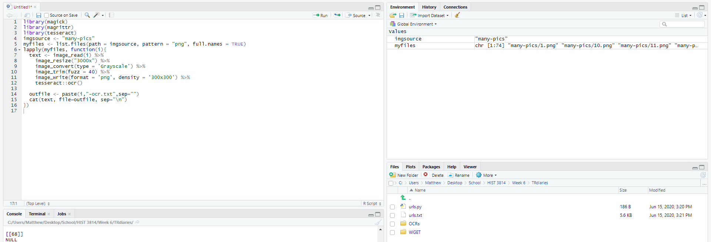
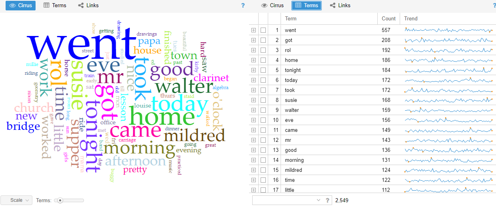
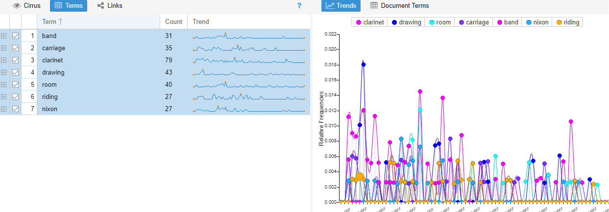
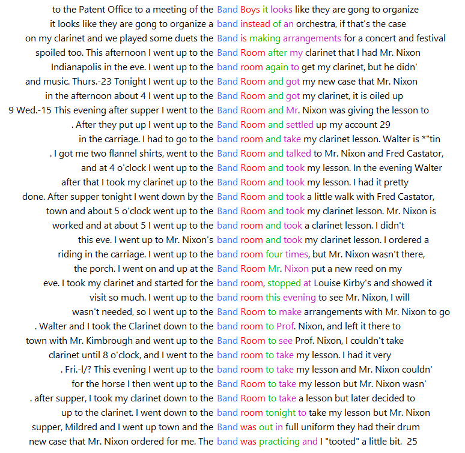
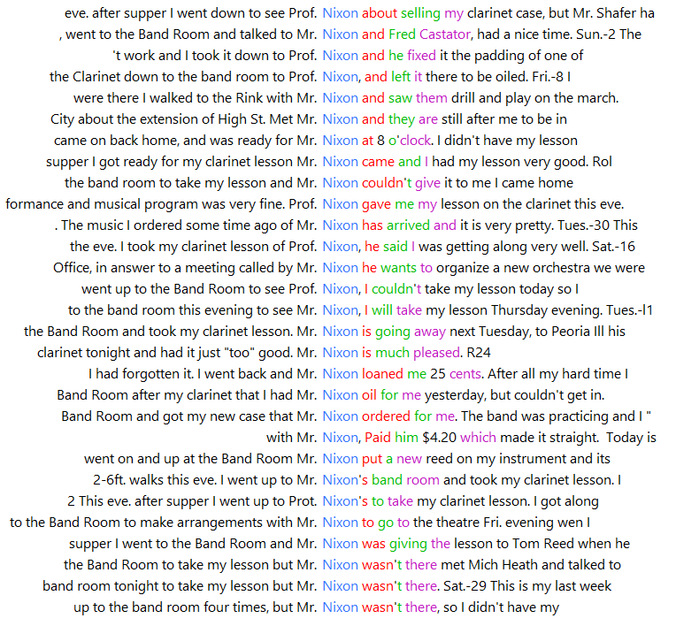
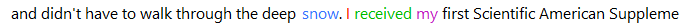
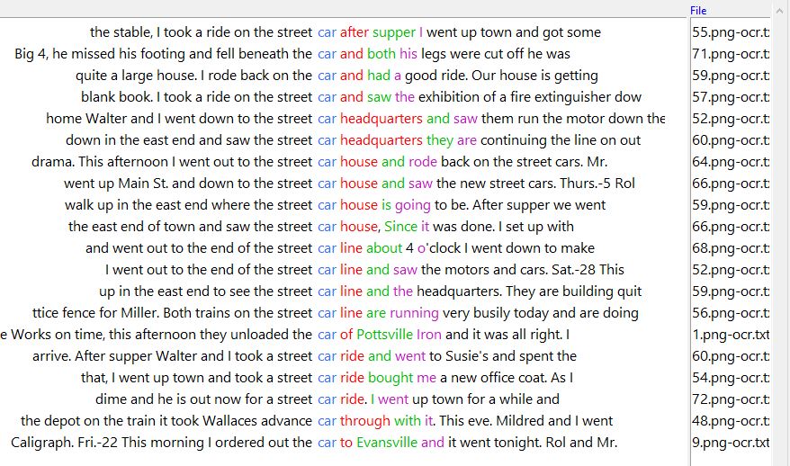

# Season's Meetings!

#### Seasonality and the Daily Life of a Nineteenth-Century Lawyer

I decided to explore the diaries of [Thomas L. Ryan](https://dmr.bsu.edu/digital/collection/RynTms) as he shares a name with my brother and it jumped out at me when I saw it. What follows is a few steps taken to extract, collate, and explore the data found within Thomas' diaries, and a potential path to explore in terms of research.

## Extracting the Diary

Given that the diary exists as a collection of images, I decided to start with WGET. I adapted some of the python code that we'd used in the past and suited it to my needs. I then did the same for the WGET command to retrieve many URLs at once, and after a short while I had 74 .png files of Thomas Ryan's diary.

## From Image to Text

With the images collated, I needed to extract the text from them. Again, following our earlier work, I modified the OCR work we did in RStudio to work with my dataset. The biggest hurdle I saw here was not realizing the code was set to search for .jpg files. Once I realized, I changed it to .png and was all set. Ninety minutes of OCRing later, I had 74 .txt documents ready to go.

## Distant Diaries

What was in those .txt files, though? I decided to take a distant approach to the dataset, since 74 diary pages would be a lot to wade through manually. Using Voyant, I input my corpus and [generated some results](https://voyant-tools.org/?corpus=dba48a189ff6b3319b6eb394dabefd9f). Given that this is a personal diary, the results were to be expected. Lots of verbs describing Thomas' days, and lots of reference to family and acquaintances. It was clear that the majority of the diary discussed day-to-day life.

However, a closer inspection of some of the trends made me curious. Looking at some of the words that decreased in usage as time went on, I began noticing things. Indoor activities like 'drawing' and 'clarinet' decreased in usage, as did references to 'room,' 'band,' 'carriage,' and 'riding.' What tied these things together?

## Spotting Patterns

I needed a way to get a closer look at these trends, so I uploaded my corpus into AntConc and began searching through my small set of words. 'Room' and 'band' were tied to 'clarinet' in the sense that Thomas would practice clarinet in the band room. This also brought attention to one Mr. Nixon--Thomas' clarinet instructor--a name that also decreased in usage over time.

 

Words like 'carriage' and 'riding' were harder to identify in patterns, but by this point I had an idea in my mind that the terms were related to the weather. Indoor activities decreased as the weather got warmer. Were vehicles related as well? Looking up 'car' indicated that perhaps streetcars were also tied to seasons, and looking up 'snow' somewhat strengthened my assumption that vehicles were used more often in the snowier months.

 

## Where Do We Go From Here?

Here, I have a hunch, a hypothesis if you will. Do seasons play a role in the writing of a diary? How are different words or phrases employed at different times of year? There would be obvious references such as 'cold' or 'warm,' but is there something to be learned beyond that? How would one's hobbies change, how would their commute to work change? What sort of considerations or inner thoughts about the weather would be transmitted through a diary?

There are all sorts of questions that can be raised from this line of thinking, and thus a number of potential research avenues to explore. 
